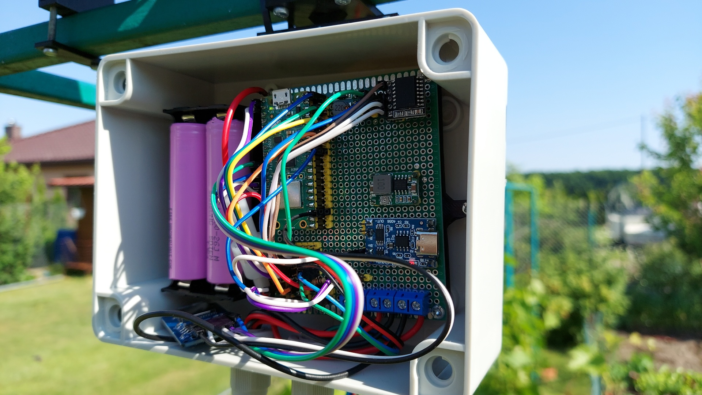
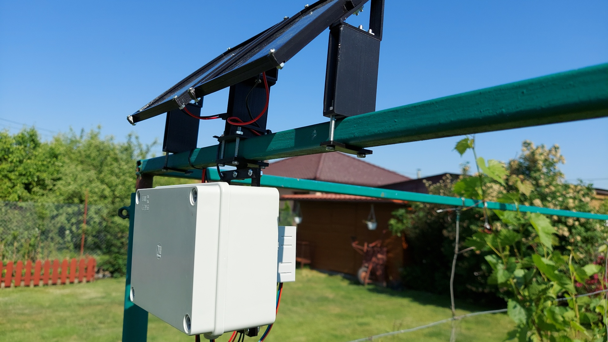

## PicoWeatherStationV2

Off-grid, standalone version of [PicoWeatherStation](https://github.com/zNitche/PicoWeatherStation) powered
by [strawberryAPI](https://github.com/zNitche/strawberryAPI).

---




#### Features

- Logging temperature & humidity.
- Logging battery & pv voltage.
- Access to logged data through WiFi hotspot and web app.
- Logs visualisation using `chart.js`.

#### Setup

1. clone repo
2. clone submodules

```
git submodule update --init --recursive
```

3. set `HOTSPOT_SSID` and `HOTSPOT_PASSWORD` in `config.py`
4. set `WEATHER_LOGS_PER_HOUR` in `config.py` (default logging sensors data every 20 minutes).
5. format sd card (FAT32).
6. `chart.js` setup:
   rpi pico doesn't have enough space for flashing css/js libs, get `chart.js` from
   cdns (`https://cdn.jsdelivr.net/npm/chart.js@4.3.0/dist/chart.umd.min.js`),
   then put it on sd card `/static/libs/chart.js`.
7. flash `RPi Pico`.

#### Wiring

ToDo

#### Parts

| Part Name                              | Quantity |
|----------------------------------------|:--------:|
| Raspberry Pi Pico W                    |    1     |
| DHT20 temperature and humidity sensor  |    1     |
| DS3231 I2C RTC module                  |    1     |
| MicroSD card                           |    1     |
| SPI MicroSD card reader module         |    1     |
| Circuit board (70x90mm)                |    1     |
| Waterproof case                        |    1     |
| Gold pin connectors                    |    ?     |
| Connecting wires                       |    ?     |
| Cell holder for 2x 18650 battery       |    1     |
| 18650 li-ion battery                   |    2     |
| Step-down Voltage Regulator - 1,0V-17V |    1     |
| Step-up converter 5V                   |    1     |
| TP4056 1S 3,7V with protection         |    1     |
| 6V solar panel 165x135x3mm             |    2     |
| 1A fuse with wires                     |    1     |
| 3.3V zener diode                       |    2     |
| 4.7k resistor                          |    1     |
| 1k resistor                            |    1     |
| 10k resistor                           |    2     |
| ARK connector raster 5.0mm 2 pin       |    3     |
| 3mm screws and nuts                    |    ?     |
| 4mm screws and nuts                    |    ?     |

#### 3D printed parts

all models are provided in `freecad` project files for easier modifications.

| Part Name         | Quantity |
|-------------------|:--------:|
| bat_mount         |    1     |
| case_backplate    |    1     |
| case_bridge       |    2     |
| case_m_top        |    1     |
| case_th_connector |    1     |
| pcb_mount         |    1     |
| pv_b_holder       |    2     |
| pv_b_s_mount      |    2     |
| pv_t_mount        |    1     |
| pv_s_mount        |    2     |
| pv_t_s_mount      |    2     |
| th_holder         |    1     |
| th_holder_b       |    1     |
| th_holder_mount   |    1     |
